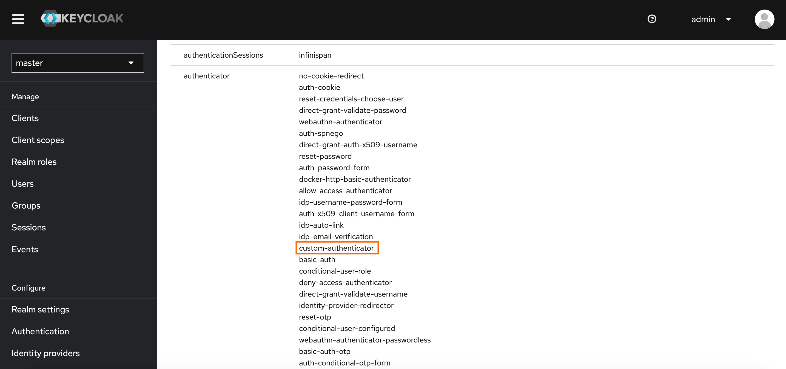
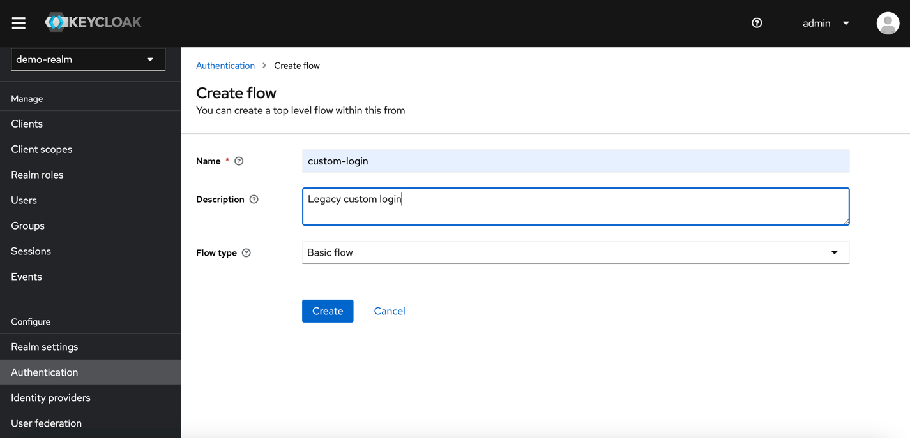
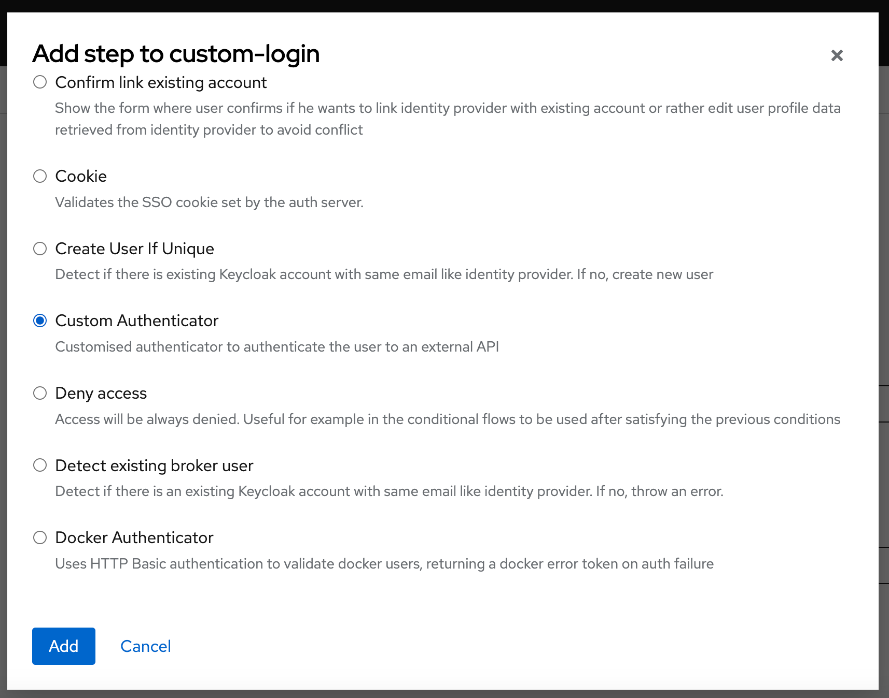
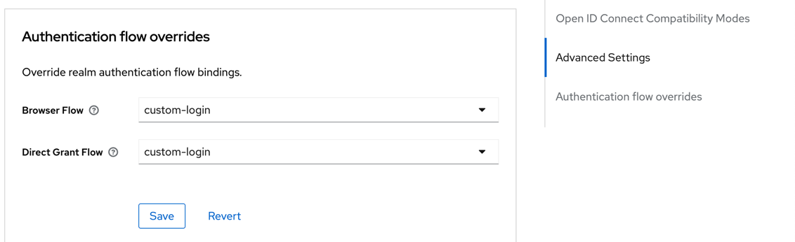

# Keycloak SPI authentication example

An example of implementing a Service Provider Interface (SPI) for Keycloak.

When legacy systems are involved, it is a common requirement to integrate users from those systems. To facilitate this integration, Keycloak supports something called custom providers. This particular example illustrates how to build a SPI that integrates a legacy restApi for authenticate user.

## Building the Module

This is a Java Maven project, so just execute mvn clean package. This builds a jar in the target directory.

## Installing the Module

Once you have a JAR file with a descriptor and the scripts you want to deploy, you just need to copy the JAR to the Keycloak providers/ directory, then run bin/kc.[sh|bat] build.

Once the project is built, copy the script engine and its dependencies to the KEYCLOAK_HOME/providers directory.

> cp target/keycloak-server-copy/providers/*.jar KEYCLOAK_HOME/providers/

After re-augment the distribution with kc.sh build, the script engine should be deployed and your script providers should work.

## Available SPIs

If you want to see list of all available SPIs at runtime, you can check Provider Info page in Admin Console as described in Admin Console section.

## Configuring the Module in keycloak admin console

Go to keycloak admin console and create a new realm. Go to the realm Authentication and create a new flow. 
Select the flow type as `Basic flow` and insert a name and description for the flow.

Add an execution step with use Add execution button. Select the `Custom authenticator` as the provider.

And set the requirement to `REQUIRED`. Save the configuration.

After to create the flow you need to associate the flow with the client. Go to the client configuration, go to advanced settings and select the `Authentication flow overrides` tab.
Select the flow that you created and save the configuration.

## Testing the Module

Use the following curl command to test the module:

> curl -X POST \
http://localhost:8080/auth/realms/yourrealm/protocol/openid-connect/token \
-H 'Cache-Control: no-cache' \
-H 'Content-Type: application/x-www-form-urlencoded' \
-d 'grant_type=password&client_id=yourclientid&username=yourusername&password=yourpassword'

